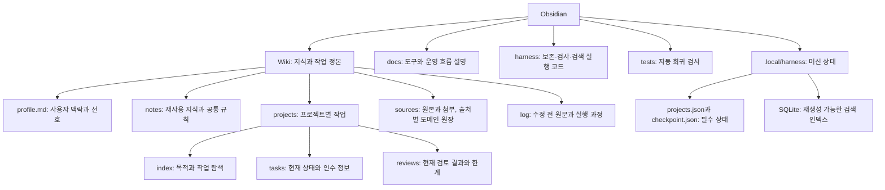
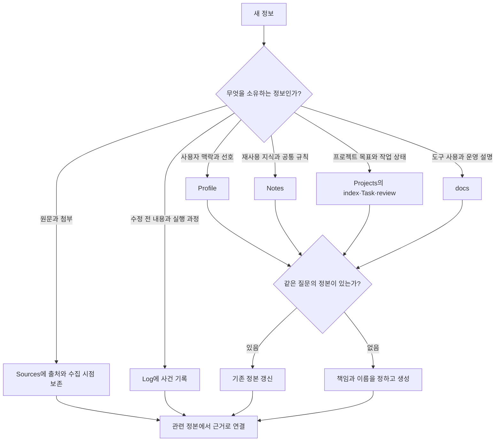
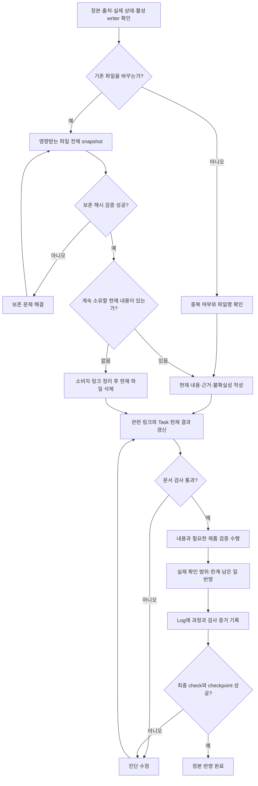
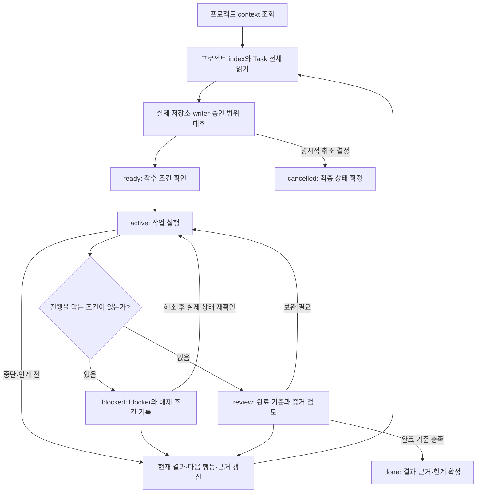
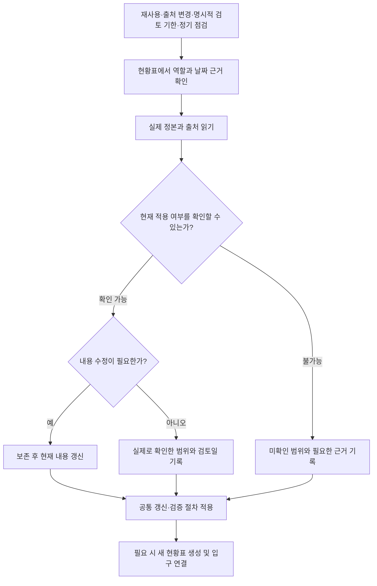

# 문서 구조와 생애주기

이 문서는 문서를 어디에 두고, 어떤 조건으로 갱신·검증·종료하는지 설명합니다. 규칙의 정본은 [루트 문서 계약](../README.md)과 [공통 작업 규약](../wiki/notes/agents/work-management-policy.md)이며, 명령 사용법은 [하네스 실행 안내](harness/document-workflow.md)가 소유합니다.

**현재 문서는 지금 적용되는 내용만, Log는 수정 전 전체 내용과 과정을 소유합니다.** 아래 흐름은 에이전트의 판단과 스크립트 검사를 함께 표현합니다. 모든 분기를 코드가 자동 강제한다는 뜻은 아닙니다.

## 구조와 책임

Wiki는 내용과 작업 상태를, docs는 이를 관리하는 도구의 사용·운영 설명을 담당합니다. 하네스는 보존부터 검사·인수·검색까지 연결한 실행 체계이며, 스크립트는 이를 구현하는 코드입니다. `.local` 전체를 삭제 가능한 캐시로 취급하지 않습니다. `hook-state.sqlite`도 미완료 편집과 세션 검증을 추적하는 필수 상태이며, 재생성 가능한 SQLite는 문서 검색 색인입니다.

제품 코드·실행 계약·원시 실행 증거는 각 제품 저장소가 소유합니다. 중앙 Task는 그 증거를 연결합니다. 독립 `orchestration/` 저장소와 루트 계약의 명시적 제외 경로는 이 관리 흐름의 대상이 아닙니다.

## 새 정보의 배치 알고리즘

입력을 책임별로 나눕니다. 원문, 해석, 작업 결과가 섞여 있다면 각 정본에 나누어 담고 서로 연결합니다.

새 현재 문서는 영문 소문자 kebab-case로 이름을 정합니다. 날짜·상태·개정 번호를 붙여 편집본을 늘리지 않습니다. 예약 이름과 원본 이름, 기존 Task ID·경로는 루트 계약을 따릅니다.

Sources의 원본을 Notes로 이동시키는 것이 아니라, 원본을 보존한 채 현재 해석을 Notes에 작성합니다. Task에서 나온 재사용 지식도 Notes에 정리하고 Task에서는 링크합니다. 완료를 이유로 Task를 Log나 별도 완료 폴더로 이동하지 않습니다.

## 갱신·검증·종료 알고리즘

삭제 분기는 현재 책임이 없는 일반 문서에 적용합니다. 완료·취소된 Task는 최종 결과와 한계를 소유하므로 같은 경로에 남습니다. 원본과 Log 보존본은 이 삭제 분기에 넣지 않습니다. 내용 일부만 적용되지 않으면 그 부분을 현재 본문에서 없애며 제거 안내를 대신 남기지 않습니다.

검증 실패나 근거 부족은 현재 한계로 기록할 수 있지만 완료 증거로 취급하지 않습니다. 문서 반영 완료와 제품 작업 완료는 별도 판정입니다. 최종 검사 전에 수정된 모든 기존 파일의 before-state가 보존되어 있어야 합니다.

여러 파일의 위치를 바꿀 때는 먼저 출발·도착 경로와 해시를 확정하고 소비자 링크까지 함께 갱신합니다. 중단된 이관 묶음은 완료·검증 전까지 현재 문맥으로 사용하지 않습니다.

## 영역별 생애주기

| 영역 | 생성 조건 | 갱신 조건 | 종료·보존 기준 |
| --- | --- | --- | --- |
| Profile | 확인된 사용자 맥락·선호 | 사용자 확인 또는 적용 조건 변경 | 현재 적용 내용만 유지 |
| Notes·공통 규칙 | 독립적으로 재사용할 질문과 근거 | 새 근거·규칙 변경·재사용 시 재검토 | 유효 내용 유지; 책임이 사라지면 보존 후 정리 |
| Project index | 관리할 프로젝트와 정본 경로 확정 | 목적·현재 작업·라우팅 변경 | 최종 프로젝트 상태와 관련 Task 연결 유지 |
| Task | 인수 가능한 작업 기록이 필요 | 의미 있는 결과·범위·blocker·다음 행동 변경 | done·cancelled도 같은 ID와 경로 유지 |
| Review | 별도 검토 판정과 근거가 필요 | 재검사로 현재 판정·한계가 바뀜 | 현재 판정·근거·남은 일 유지; 실행별 과정은 Log |
| Sources 원본 | 원문·첨부를 확보 | 새 출처 버전을 확보 | 원본 bytes와 출처·시점 보존; 정정 해석은 현재 owner에 기록 |
| 출처별 활성 도메인 원장 | 해당 도메인 규약이 정본으로 지정 | 도메인 사실·상태 변경 | 해당 규약과 공통 보존 계약 적용; 원본 보관물과 구분 |
| Log | 편집 전 보존 또는 실행 사건 발생 | 새로운 사건·검증 결과 발생 | 보존본을 덮어쓰지 않고 새 기록으로 남김; history 범위로 조회 |
| docs | 도구·운영 설명에 독립적인 질문이 있음 | 실제 규약·명령·구현 범위 변경 | 현재 사용 설명 유지 |
| HTML·JSON·YAML 등 | 정본의 부속 자료 또는 도메인 데이터 필요 | 소유 문서·도메인의 변경에 연동 | 확장자가 아닌 현재 내용·원본·이력 역할로 판정 |

읽기 전용 질문이나 사소한 편집마다 Task를 만들지는 않습니다. 현재 설명을 갱신할 때 실행 과정을 누적하지 않고 Log를 연결합니다.

## Task 진행과 에이전트 인수

다음은 상태의 운영 의미를 나타낸 대표 흐름입니다. 모든 전이를 자동 검사하는 상태 머신 명세는 아닙니다.

인계 자체를 위해 상태를 done으로 바꾸지 않습니다. 오래된 갱신 시각만으로 다른 writer의 작업을 인수하지 않습니다. ready·active·blocked·review 어느 상태에서든 취소 결정은 cancelled로 반영할 수 있으며, 결정 과정은 Log가 소유합니다. 완료 여부는 에이전트 실행 종료나 문서 검사 성공이 아니라 Task의 완료 기준과 실제 증거로 판단합니다.

## 최신성 점검 알고리즘

내용 수정일, 검토일, 원본 수집일, 파일시스템 mtime은 서로 다른 값입니다. 날짜가 없으면 미상으로 두며, 읽지 않은 문서에 오늘 날짜를 일괄 입력하지 않습니다. 현황표 생성과 검색 인덱스 재생성은 사실 검토가 아닙니다. 검색 결과를 사용할 때도 실제 owner를 읽어 적용 가능성을 확인합니다.

## 구현 범위와 확인 근거

이 문서는 2026-09-27의 로컬 계약·라우팅·검토 결과를 기준으로 작성했습니다. 전체 문서의 사실이나 제품 실행 상태를 재검증한 문서가 아닙니다.

| 항목 | 운영 시 구분 |
| --- | --- |
| snapshot·해시 검증·check·checkpoint·검색 | 실행 명령이 제공됩니다. check 성공이 내용의 정확성을 보장하지는 않습니다 |
| checkpoint 누락·손상 | 정상 check와 checkpoint가 오류로 종료합니다. 최초 설정만 명시적 initialize를 사용합니다 |
| 중단 이관·정본 부재 | current 검색·인덱스·context가 미완료·손상된 이관 기록을 거부합니다. context는 실제 workspace와 프로젝트 index를 요구합니다 |
| Sources 내부 활성 정본·비 Markdown 자료 | 현재 영역의 비 Markdown 부속 자료와 등록한 Dae-Jeong 도메인은 해시 보존 대상입니다. current_domains로 선택된 Markdown·YAML·JSON은 현재 검색과 편집 검사에 포함됩니다. 제품 스키마·의미 검증은 제품별로 수행합니다 |
| 문단 링크·의미·latest-only 준수 | 지원하는 로컬 Markdown 문단과 HTML ID 링크를 검사합니다. 외부 URL 문단·의미·latest-only의 완전한 준수는 본문과 출처 검토가 필요합니다 |
| 여러 세션의 동시 편집 | 공통 checkpoint를 사용합니다. 반복 편집 전에도 현재 bytes를 보존해야 하며 세션별 원자적 게시·checkpoint 격리는 구현되지 않았습니다 |

구체적인 결함·수정 기준·수용 판정은 [내용·규칙 검토](../wiki/projects/llm-wiki/reviews/content-audit.md), 남은 작업은 [구현 Task](../wiki/projects/llm-wiki/tasks/shared-task-harness.md)가 소유합니다. 문서별 목록과 날짜 근거는 [전체 문서 현황](../wiki/projects/llm-wiki/reviews/document-register.md)에서 찾습니다.
